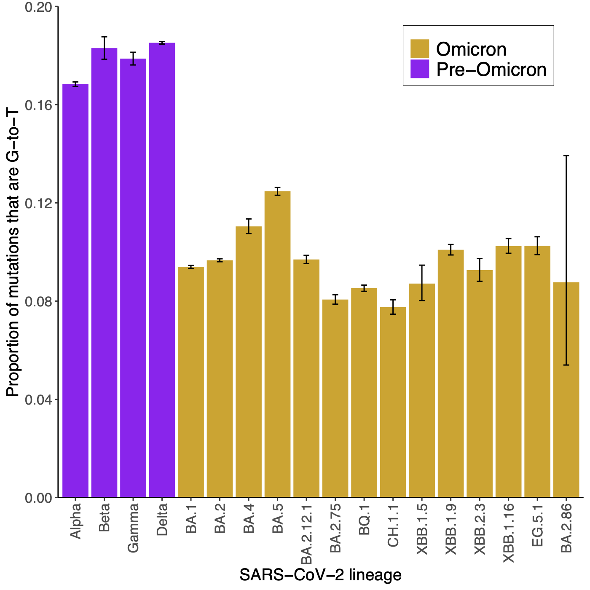

# SARS-CoV-2_lineage_spectra

## Overview

This repository contains mutational spectra for SARS-CoV-2 lineages and analyses of these spectra.

These analyses follow the paper [A lung-specific mutational signature enables inference of viral and bacterial respiratory niche](https://www.microbiologyresearch.org/content/journal/mgen/10.1099/mgen.0.001018) and the associated repository [here](https://github.com/chrisruis/SARS-CoV-2_spectra)

## G-to-T mutations

The level of G-to-T mutations within a mutational spectrum has [been linked with the major replication niche(s) of SARS-CoV-2, other viruses and bacteria](https://www.microbiologyresearch.org/content/journal/mgen/10.1099/mgen.0.001018). The level of G-to-T mutations may therefore help infer replication niches.

This plot shows the proportion of G-to-T mutations amongst major SARS-CoV-2 lineages:

## Current SARS-CoV-2 lineage spectra

More details on the analysis pipeline are below.

The mutational spectra for major SARS-CoV-2 lineages can be found in the [mutational_spectra directory](https://github.com/chrisruis/SARS-CoV-2_lineage_spectra/mutational_spectra)
