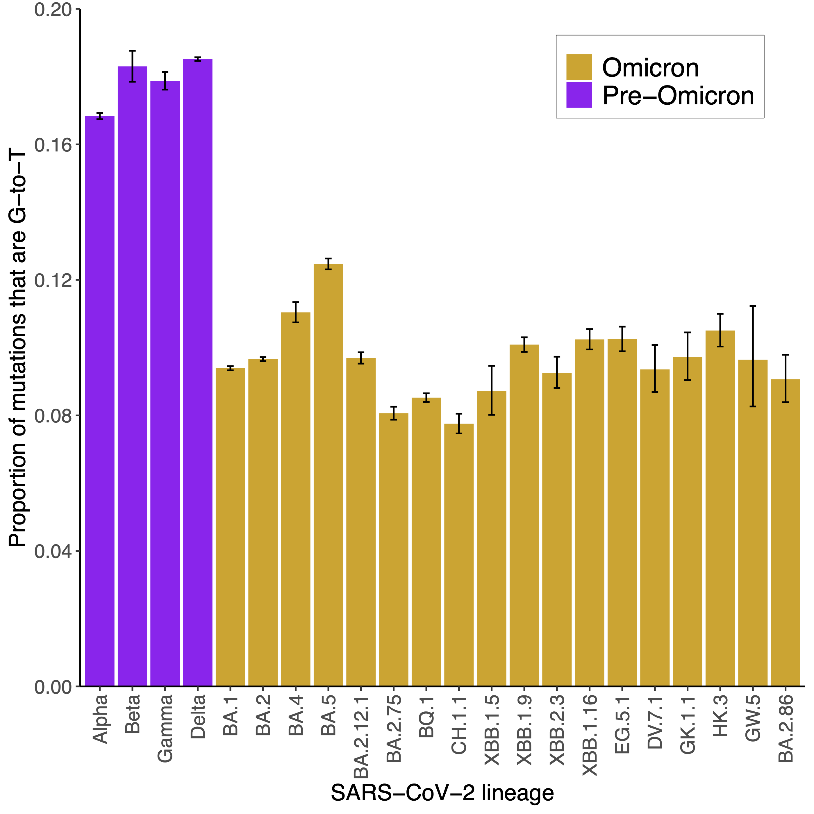

# SARS-CoV-2_lineage_spectra

## Overview

This repository contains mutational spectra for SARS-CoV-2 lineages and analyses of these spectra.

These analyses follow the paper [A lung-specific mutational signature enables inference of viral and bacterial respiratory niche](https://www.microbiologyresearch.org/content/journal/mgen/10.1099/mgen.0.001018) and the associated repository [here](https://github.com/chrisruis/SARS-CoV-2_spectra)

## Analyses of emerging and recently dominant Omicron lineages

The level of G-to-T mutations within a mutational spectrum has [been linked with the major replication niche(s) of SARS-CoV-2, other viruses and bacteria](https://www.microbiologyresearch.org/content/journal/mgen/10.1099/mgen.0.001018). Viruses that replicate in the lung show higher levels of G-to-T mutations than viruses that replicate in the upper respiratory tract. Omicron replication is largely restricted to the upper respiratory tract so the major Omicron lineages BA.1, BA.2, BA.4 and BA.5 have lower levels of G-to-T mutations than the Alpha, Beta, Gamma and Delta variants which additionally replicate in the lung.

We can therefore use the level of G-to-T mutations to help infer replication niches. In this repository, I calculate the level of G-to-T mutations in emerging SARS-CoV-2 lineages and compare this with earlier lineages.

This plot shows the proportion of G-to-T mutations amongst major SARS-CoV-2 lineages:



The level of G-to-T mutations within emerging and recently dominant Omicron lineages has remained low, similar to early Omicron lineages. This supports recent Omicron lineages continuing to replicate predominantly within the upper respiratory tract.

## Current SARS-CoV-2 lineage spectra

The mutational spectra for major SARS-CoV-2 lineages can be found in the [mutational_spectra directory](https://github.com/chrisruis/SARS-CoV-2_lineage_spectra/mutational_spectra).

The Alpha, Beta, Gamma, Delta, BA.1, BA.2, BA.4 and BA.5 spectra were calculated in a [previous publication](https://www.microbiologyresearch.org/content/journal/mgen/10.1099/mgen.0.001018). Other spectra were calculated from the public SARS-CoV-2 UShER tree, which is available [here](http://hgdownload.soe.ucsc.edu/goldenPath/wuhCor1/UShER_SARS-CoV-2//) and can be viewed using Taxonium [here](https://taxonium.org/?backend=https://api.cov2tree.org). Current spectra were calculated using the tree from 3rd October 2023.

To calculate spectra from the UShER tree, I first extract sample paths from the tree using matUtils:
```
matUtils extract -i public-latest.all.masked.pb -S sample-paths
```

I then identify root nodes for lineages of interest from clade paths. The clade paths are extracted from the tree using:
```
matUtils extract -i public-latest.all.masked.pb -C clade-paths
```

After identifying the root nodes, spectra can be calculated for all lineages of interest simultaneously using the sample-paths file extracted above and the root node identifiers for the lineages. For example, to calculate spectra for the recent Omicron lineages in the 3rd October 2023 tree:
```
python3 calculate_lineage_spectra.py -s sample-paths -n XBB.1.5____node_416633 XBB.1.16____node_341824 EG.5.1____node_361956 BA.2.86____node_465866 BA.2.75____node_436699 XBB.2.3____node_419687 BA.2.12.1____node_468123 BQ.1____node_544852 CH.1.1____node_442976 XBB.1.9____node_350841 -r wuhan-hu-1.fasta
```
This outputs the mutational spectrum for each lineage and a reference sequence for the lineage (the ancestral sequence at the root node of the lineage, used to rescale the spectrum below).

To compare spectra between pathogens with different nucleotide compositions, [they need to be rescaled by genomic context availability](https://www.biorxiv.org/content/10.1101/2023.06.15.545111v1). I therefore rescale the spectra using the rescale_spectrum.py script within [MutTui](https://github.com/chrisruis/MutTui):
```
python3 rescale_spectrum.py -s XBB.1.5_spectrum.csv -r XBB.1.5_reference.fasta -o XBB.1.5_spectrum_rescaled.csv --rna
```

The rescaled spectrum can then be plotted with [MutTui](https://github.com/chrisruis/MutTui):
```
MutTui plot -s XBB.1.5_spectrum_rescaled.csv -o XBB.1.5_spectrum_rescaled.pdf --rna --plot_proportion
```

## Acknowledgements

The spectra are calculated from sequences generated by individuals all over the world. We gratefully acknowledge their hard work in generating the sequences and submitting to databases.

Spectra are calculated from the UShER tree which was developed by Yatish Turakhia and maintained by Angie Hinrichs.
